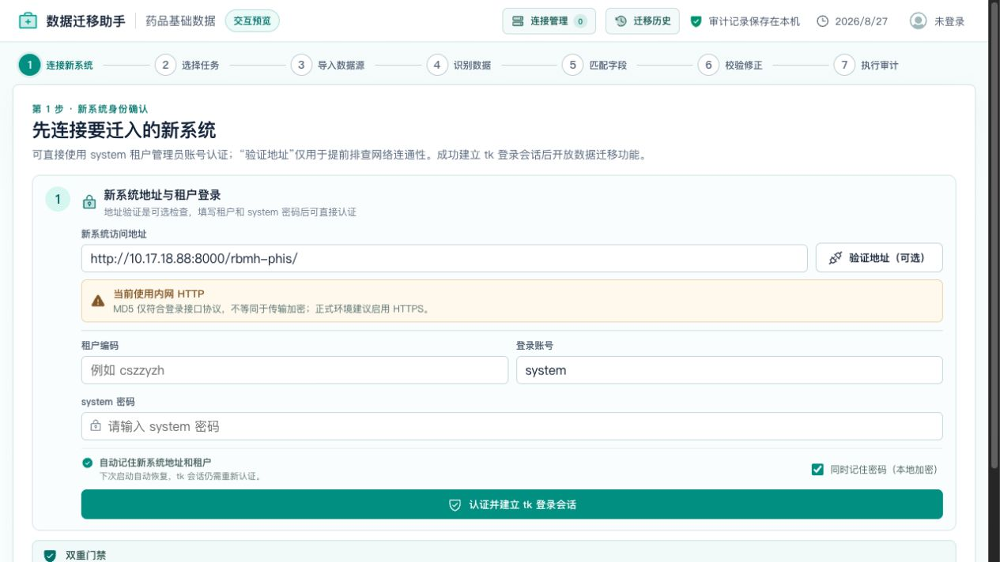
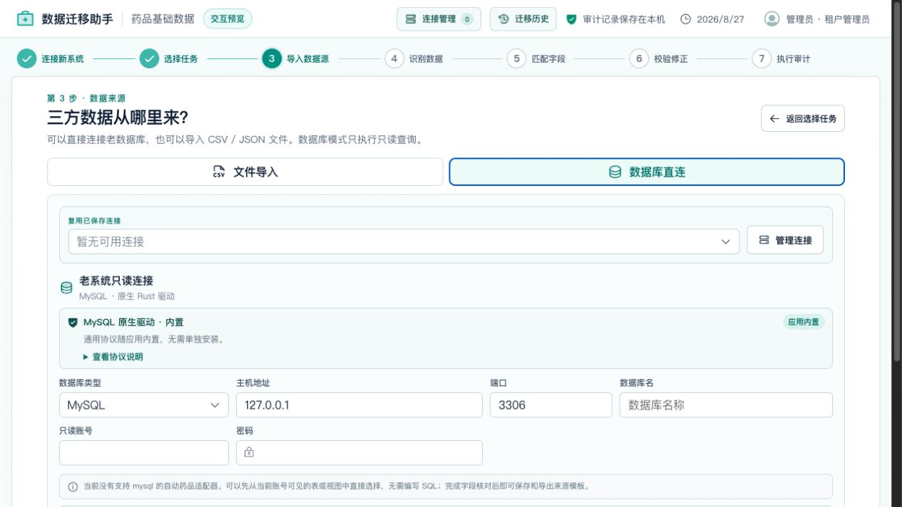
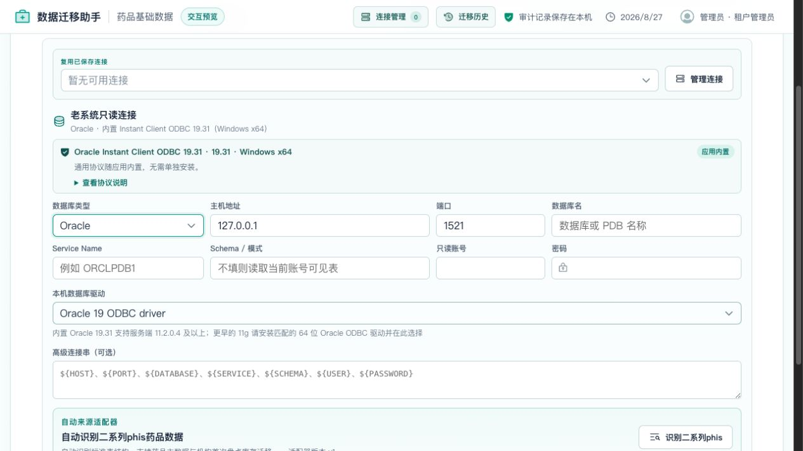
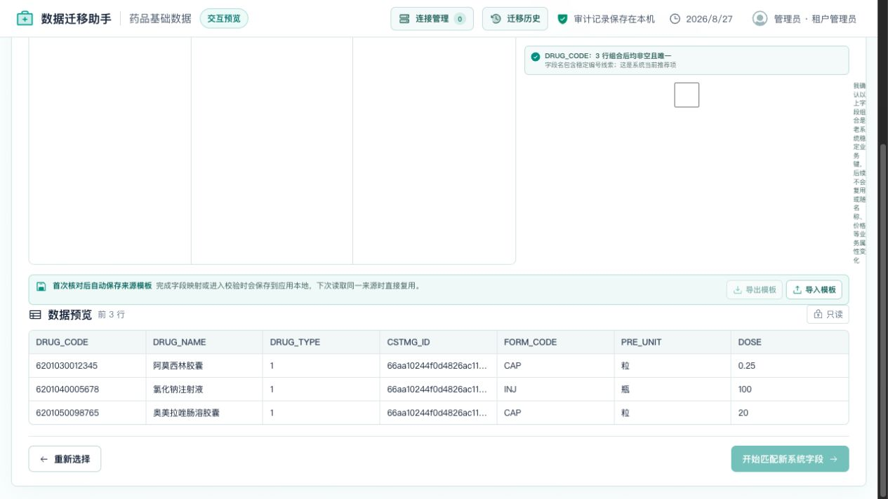
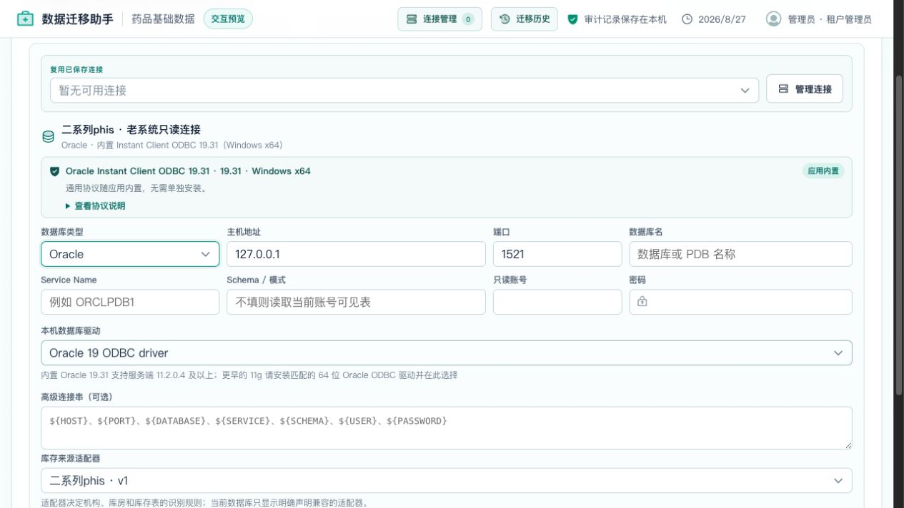
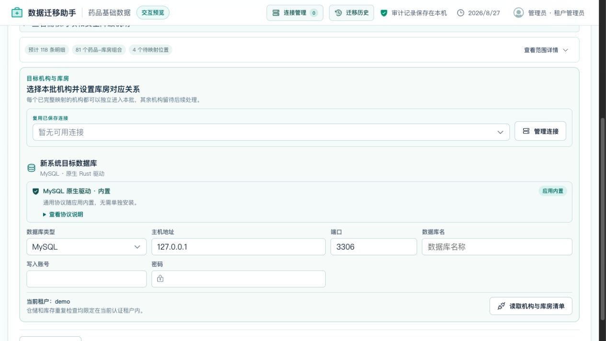
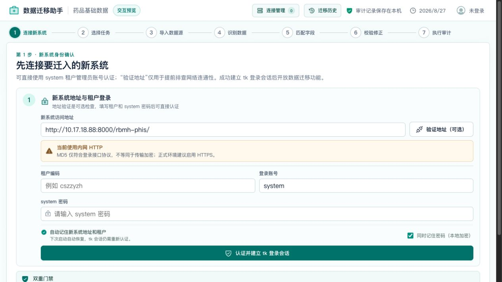
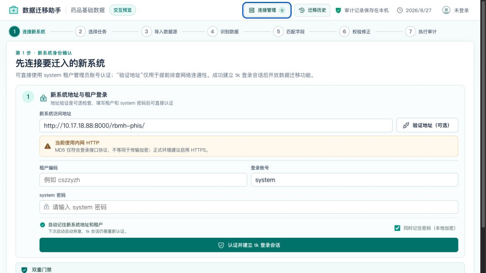

# 三方 HIS 接入友好性与适配器维护门槛审计

审计日期：2026-08-27
审计范围：药品基础信息同步、机构库存初始化、通用数据库接入、专用来源适配器、字段映射与维护工具链。

## 总体结论

- 对已经有专用适配器的 HIS（当前为二系列phis），现场接入友好性较高，连接、结构识别、范围选择、字段核对和库存前置门禁已经形成完整引导。
- 对没有专用适配器的 HIS，药品基础数据仍可通过表/视图、只读 SQL、CSV/JSON 和通用字段映射完成，现场门槛为中等；如果药品数据分散、多字典差异或缺少稳定业务键，仍需要熟悉 HIS 数据结构的实施人员参与。
- 通用机构库存迁移目前不可用。库存任务必须有专用适配器，因此“支持多种数据库”不等于“已经自动支持这些数据库上的任意 HIS 库存”。
- 维护框架本身已经比较成熟：适配包自动发现、公共 SDK、机器可读结构契约、脚手架、脱敏支持包、项目差异夹具、单命令维护交接包和交付门禁都已具备。药品基础与机构库存现在均有独立的诊断历史、当前报告和脱敏支持包。但新增一个复杂 HIS 的自动药品/库存适配器仍属于专业开发工作，主要成本在业务表关系、稳定键、包装/金额口径和可执行回归测试，不在清单注册或维护文件拼装。

## 接入门槛分层

| 场景 | 现场接入门槛 | 维护门槛 | 当前判断 |
| --- | --- | --- | --- |
| 二系列phis药品迁移 | 低到中 | 中 | 自动识别与预设较完整，主要工作是项目差异和字典核对 |
| 二系列phis库存迁移 | 中 | 中到高 | 引导和安全门禁完整，但机构/库房、药品台账与包装异常仍需人工决策 |
| 未适配 HIS 的单表/视图药品 | 中 | 低 | 无需写代码，字段映射和模板可复用 |
| 未适配 HIS 的多表药品 | 中到高 | 中 | 需要只读 SQL、稳定键设计、字典语义核对 |
| 未适配 HIS 的机构库存 | 不可直接实施 | 高 | 必须开发专用库存适配器并补齐验收证据 |
| 已适配 HIS 的小版本结构差异 | 低到中 | 中 | 契约可区分阻断、核对和安全降级；药品任务已有诊断闭环 |

## 主要优势

1. 入口清楚：药品与库存任务分开，库存依赖药品台账的前置条件被直接说明。
2. 数据库覆盖广：界面可选择 MySQL、Oracle、DM8、openGauss/GaussDB、Vastbase、GBase、KingbaseES 和 PostgreSQL 等系列，并区分内置协议与厂商驱动。
3. 未适配 HIS 仍有退路：可选表/视图、只读 SQL 或文件，不会因为没有专用适配器而完全阻塞药品主数据迁移。
4. 字段映射较适合实施人员：目标字段导航、状态筛选、可信推荐、药品样例和即时预览放在同一个工作区。
5. 专用库存适配器复用公共安全流程：机构/库房映射、药品台账、空库检查、逐库试迁移、首次盘点和安全撤销不是由各厂商适配器自行绕过。
6. 维护门禁有效：`adapter:verify` 当前验证 3 个正式适配包和 1 个隔离教学包，0 个错误、0 个提醒；10 条业务验收证据符合执行策略，4 个项目差异夹具及对应 Rust 测试通过。全量回归为前端/Node 112 项通过、Rust 179 项通过，6 项需真实数据库环境的测试按预期跳过。

## 主要风险

### 已改进：数据库兼容范围与 HIS 业务兼容范围

任务选择页现在会从已注册适配器清单实时生成“接入能力判断”。药品任务分开列出专用自动识别、通用数据库表/视图或只读 SQL、CSV/JSON 三条路径；库存任务只展示真正声明 `INVENTORY` 能力的专用适配器，并明确说明 Oracle、MySQL 或国产数据库能连接不等于任意 HIS 库存可直接迁移。自动适配器清单新增机器可读的 `sourceCompatibility`：明确区分 `STRUCTURE_CONTRACT`（按现场结构契约判定）与 `DECLARED_VERSION_RANGE`（按有证据的已验证版本范围），验收拒绝“声明版本支持但没有列明验证范围”，也拒绝在结构契约模式中夹带版本认证声明。二系列当前明确采用结构契约模式，版本号只作项目记录；任务选择页会同时展示该判断和实际门禁。旧版自动适配器仍可读取，但会安全降级为“未声明厂商版本范围，必须通过任务级结构验收”，避免兼容升级被误报为版本认证。浏览器在药品与库存任务下均已复核，1280×720 无横向溢出。

### P1：新增复杂 HIS 的业务开发成本仍然高

适配器目录和绑定已自动化，但自动适配器仍需维护 `manifest.json`、`acceptance.json`、`adapter.rs`、`MAINTENANCE.md`、脱敏夹具和真实 Rust 回归测试。脚手架现会额外生成 `PROJECT_INTAKE.md`，把版本边界、稳定键、范围语义、商品关系、字典、轻量库存范围、选择后过滤、包装金额和首次盘点边界变成逐项证据清单，减少依赖个人经验的遗漏。新增 `adapter:handoff` 后，维护人员可从一个已校验、任务级脱敏支持包一次生成中文实施计划、契约差异草稿、项目变体夹具草稿和文件级 SHA-256 清单；计划按契约阻断、业务核对、来源实现、夹具、可执行证据和交付门禁排序，库存阻断未解决时不会建议先进入实现。接收方可运行 `adapter:handoff-verify` 自动验证清单自校验、三个产物 SHA-256、任务/适配器一致性、必需文件、未声明额外文件和隐私字段；即使重新计算全部哈希，重新注入来源指纹、Schema、连接、SQL或样例字段仍会被拒绝。输出不会覆盖既有审核目录，也不会自动改写正式契约、夹具或代码。当前二系列的核心读取逻辑约 3,237 行，说明复杂 HIS 的主要成本仍是业务语义和 SQL，不是配置文件本身；该风险继续降低但没有消失。

### 已改进：第二家 HIS 教学适配器与 SDK 边界

新增一个不会进入正式运行时注册表的 PostgreSQL `STANDARD_HIS` 教学适配器，独立于二系列代码，现已同时覆盖药品和机构库存：包清单、公共只读查询、结构识别、药品来源键、机构与药库药房目录、轻量范围、本批库存明细、包装金额口径、通用字段映射、机器可读契约、维护说明、两类脱敏项目夹具和可执行 Rust 测试。公共 SDK 新增跨数据库受限只读查询入口，新适配器无需直接依赖 ODBC、PostgreSQL 协议或中央编排模块；验收会拒绝非二系列新适配器绕过 SDK 直接引用 crate 内部模块。教学库存只负责来源标准化，公共流程继续强制机构/库房映射、药品台账、空库检查、逐库试迁移、首次盘点和安全撤销。教学目录以下划线开头，构建注册表和现场界面均不会将它误报为已支持厂商。

### 已改进：库存结构诊断闭环

库存页面已增加当前差异报告、最多 20 次本地结构历史和脱敏支持包导出。药品基础与机构库存记录按任务隔离，支持包带任务标记并自动选择对应契约；显式跨任务分析会被拒绝，同时保留对旧支持包的兼容。已通过真实浏览器导出和离线 SHA-256/脱敏校验。

### 已改进：高级连接信息占据主流程

Oracle、达梦、GBase 等非原生连接现在默认只展示业务必需参数，本机数据库驱动和高级连接串收进可见的“专家连接选项”。已使用自定义连接串或驱动未就绪时会自动展开，常规 Oracle 19.31 内置驱动则只显示当前使用摘要，不丢失原配置。

### 已改进：跨步骤时页面滚动位置复位

主步骤变化时现在会在 React 绘制前同步将文档和工作区滚动位置复位到顶部。真实浏览器验证中，Oracle 长页位于 `scrollY=693` 时进入“识别数据”，新步骤立即回到 `scrollY=0`，标题和当前控制完整可见。

### 已改进：首屏对比度、键盘焦点与 200% 等效缩放

真实浏览器测量发现主按钮和当前步骤的白字/白色数字与原品牌绿仅约 3.49:1，两处浅色辅助说明约为 3.66:1 和 3.81:1；连接数量徽标及 HTTP 提示也低于 4.5:1。现已将承载白字的操作绿调整为深一级品牌色，辅助文字改为仍属原设计体系的深灰绿，并给按钮、输入框、自定义可聚焦区域统一增加 3 像素高可见焦点描边。修复后当前认证入口可见文字未再测出低于对应阈值的项目。

以当前 1265×968 桌面视口折算为约 633×484 CSS 像素进行 200% 缩放等效复核时，原页面横向溢出 55 像素，顶部品牌、动作和七步进度相互挤压。现已让顶部在窄视口分为两行、只保留当前步骤文字并缩短连接线；复测文档宽度为 618/618 像素，横向溢出为 0，认证表单继续通过纵向滚动完整可达。该结果证明浏览器等效重排已改善，但不替代 Windows 系统缩放与 WebView 真机验证。

### 已改进：结构契约差异草稿

维护工具现可从通过 SHA-256、格式与隐私校验的 v2 现场支持包生成独立的 `acceptance.json` 差异草稿，自动列出新增表、字段、观察到的数据库类型和类型族，并带出当前契约的阻断、核对与兼容降级项。草稿不会直接改写验收契约，也不会携带来源指纹、Schema、样例值、SQL、字段注释、连接信息或租户信息；维护人员只需删除无关候选并补齐“影响业务、是否必需、如何安全降级”，再加入夹具与回归测试。该机制降低了机械录入和漏字段风险，但保留了必要的业务审核门禁。

### 已改进：项目变体夹具草稿

同一份已校验的任务级支持包现在还能生成脱敏项目变体夹具草稿，自动填写适配器、数据库家族、任务、当前表字段、数据库物理类型和契约影响。v2 夹具保留会改变 SQL 生成的 DATE/字符日期、NUMBER 和 VARCHAR2/NVARCHAR2 等类型差异，Rust 读取器继续兼容只含字段名的 v1 夹具。明确阻断建议 `BLOCK`，完全兼容建议 `PASS`，仍需业务判断时输出不可交付的 `REVIEW`；维护人员必须补可读标题、业务预期和真实可执行 Rust 测试路径后才能移入 `fixtures`。草稿不携带来源指纹、Schema、样例值、SQL、字段注释、连接或租户信息；静态验收还会拒绝未知字段和样例值混入。验收现会拒绝占位 `rustTest`，执行门禁仍会拒绝实际运行零项测试，避免自动草稿被误当成回归证据。

## 建议的优化顺序

1. 已完成：库存诊断历史与脱敏支持包导出，药品和库存已形成一致的维护闭环。
2. 已完成：增加“接入能力判断”，在输入连接信息前说明通用药品可做、自动药品需适配器、库存必须有专用适配器。
3. 已完成：修复步骤切换的滚动复位，并把驱动与高级连接串折叠为专家选项。
4. 已完成：为 `acceptance.json` 增加从支持包生成独立差异草稿的命令，并纳入专用适配器维护说明门禁。
5. 已完成：增加独立于二系列的 `STANDARD_HIS` 药品与库存教学适配器，并把其编译、契约及两类项目夹具纳入 `adapter:verify`；正式运行时注册表保持不变。
6. 已完成：从任务级支持包生成脱敏项目变体夹具草稿，自动带出结构与契约影响，同时保留人工业务结论和真实可执行测试门禁。
7. 已完成：项目变体夹具升级为兼容旧格式的 v2 类型化结构，使数据库物理类型变化进入自动回归，同时维持严格脱敏边界。
8. 已完成：自动适配器脚手架增加任务化接入调查清单，并为库存契约/夹具预置机构、库房、库存稳定键、药品商品键、数量价格和管理包装结构，把高风险业务口径与交付证据前置，降低首次适配对个人经验及空白配置的依赖。
9. 已完成：增加 `adapter:status` 分阶段就绪诊断，把新库存适配器首次出现的数十条严格错误压缩为当前阶段、代表问题、未完成数量和明确下一步；完整错误及所有交付门禁继续由 `adapter:validate` / `adapter:verify` 保留。
10. 已完成：公共适配器 SDK 增加数据库家族感知的 Schema/对象安全限定和有上限的本批文本过滤列表；教学适配器已实际迁移，脚手架和调查清单禁止各厂商重复实现引号、转义和无上限列表拼接。
11. 已完成：`acceptance.evidence` 从源码文字包含升级为真实 Rust 测试绑定，`adapter:evidence` 精确执行必需证据并拒绝 0 项测试、错误模块路径和被忽略的必需测试；真实数据库证据只能显式标为 `OPTIONAL_LIVE` 且必须使用 `#[ignore]`。该门禁已并入 `adapter:verify`。
12. 已完成：每条业务证据增加 `tasks` 归属，验收强制覆盖适配器声明的每个迁移任务，防止用多条药品测试形式化满足库存适配器的证据数量要求。
13. 已完成：实测认证入口的文字对比度、键盘焦点与 200% 缩放等效重排；修复主操作色、辅助文字、统一焦点描边和窄视口顶部/步骤导航，新增自动回归保护。
14. 已完成：增加 `adapter:handoff` 单命令维护交接包，从一个任务级脱敏支持包统一生成实施计划、契约草稿、夹具草稿和 SHA-256 清单；按业务阻断优先级组织工作，禁止覆盖既有审核记录，并将该流程纳入正式及教学适配器维护说明门禁。
15. 已完成：增加 `adapter:handoff-verify` 交接接收验收，验证清单自身、每个产物哈希、固定文件集合、任务/适配器一致性和隐私边界；专项回归覆盖清单篡改、产物篡改、缺失文件、额外文件，以及攻击者重新计算全部哈希后注入敏感字段的情况。
16. 已完成：增加机器可读的 HIS 来源兼容策略，区分“按现场结构契约验收”和“按明确版本范围验收”；二系列固定采用结构契约模式，脚手架默认保守声明，静态验收阻止无证据版本认证，任务选择页直接展示判定依据和后续门禁。

## 流程证据

### 1. 新系统认证入口——健康

### 2. 药品与库存任务选择——健康

### 3. 通用数据库接入——基本健康

### 4. Oracle 专用适配器入口——基本健康

### 5. 来源稳定键与数据预览——滚动复位已修复

### 6. 字段匹配工作区——健康但专业信息密度较高

### 7. 库存来源适配器——基本健康

### 8. 库存结构兼容摘要——健康

### 9. 库存位置范围明细——健康

## 可访问性与验证边界

- DOM 检查确认认证入口的主要输入框、按钮和复选框具有可识别名称；现有字段映射工作区也有导航和状态文字，不只依赖颜色。
- 当前认证入口已完成可见文字实际对比度测量；修复后的本轮检测结果为 0 个低于对应阈值的可见文字项目。该自动测量以计算样式和可见背景为依据，复杂渐变、图片背景和全部后续业务页面仍需逐屏人工复核。
- 键盘抽查确认顶部操作可进入焦点，焦点样式为 3 像素蓝色实线并有 2 像素偏移；尚未完成从认证到执行审计的全流程顺序、弹窗焦点锁定和返回焦点验证。
- 已完成 633×484 CSS 像素的 200% 桌面缩放等效重排测试，当前认证入口无文档级横向溢出；尚未完成 Windows 125%/150%/200% 系统缩放和 Tauri WebView 真机验证。
- 本次没有完成屏幕阅读器朗读和真实第三方数据库错误恢复测试，因此不能据此判断符合完整 WCAG 要求。
- 本次界面流程使用浏览器预览数据；维护结论另外依据当前适配器源码、清单、验收契约和实际执行的专项测试。

## 可访问性专项流程证据

### 1. 正常桌面认证入口——健康

### 2. 键盘焦点——健康

顶部“连接管理”获得键盘焦点时具有清晰的 3 像素描边。当前只抽查了入口操作，完整键盘顺序仍需单独执行。

### 3. 200% 缩放等效重排——基本健康

顶部信息改为两行，七步进度只显示当前步骤文字，页面无文档级横向溢出；后续内容通过纵向滚动到达。

